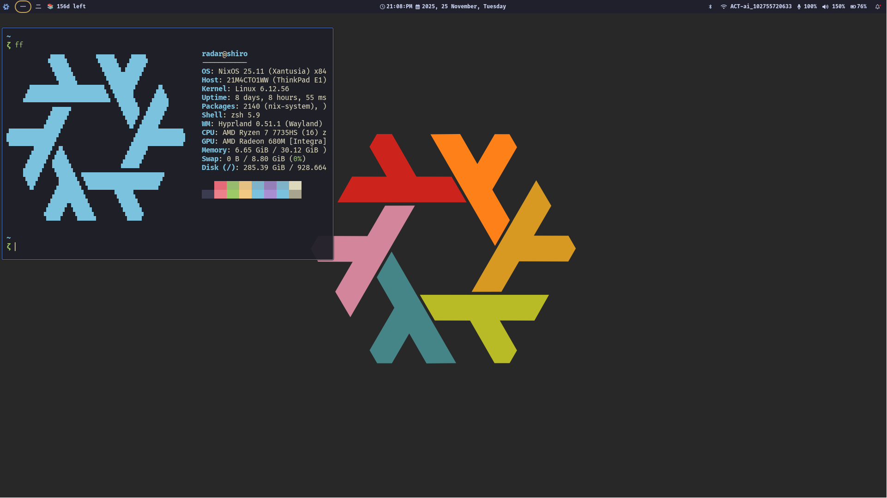

<a href="https://www.pranavrk24.com">Website</a> • <a href="mailto:pranavrk.me@gmail.com">Email</a> • <a href="https://twitter.com/@pranavrk24">Twitter</a>

Hi there! I'm Pranav. I love writing code and contributing to open source! I mainly work on backend stuff with Go, Rust, and Zig, and I also work on web programming using Astro, and Svelte whenever I feel like it. Fluent in Tamil and English, currently learning Japanese.

<ul>
  <li><a href="https://github.com/radar07/.dots">Dotfiles</a></li>
  <li><a href="https://github.com/radar07/labs">Labs</a></li>
</ul>

